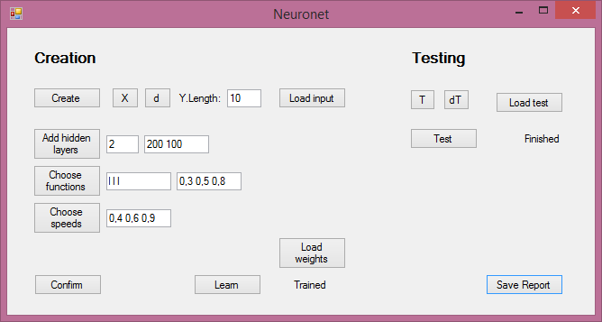

Приложение позволяет создать сеть из произвольного количества полносвязных слоев настраиваемой величины 
с логистической функцией активации. Параметр функции активации и скорость обучения также можно задать.

В папках X/d/T/dT расположены файлы датасета MNIST соответственно: обучающая выборка, лейблы для обучающей выборки, 
тестовая выборка, лейблы для тестовой выборки. Не забудьте заменить пути к папкам по умолчанию на свои. 
В W сохраняются веса сети. 

Работа с приложением происходит следующим образом: 

**Create** -> **X** -> выбор папки -> **d** -> выбор папки -> **Y.Length** -> ввод количества классов - 10 -> **Load input** 
-> **Add hidden layers**(необязательно) -> выбор количества скрытых слоев -> выбор количества нейронов в каждом слое 
-> **Choose functions**(необязательно) -> l - логистическая функция - вводится через пробел для каждого скрытого слоя + для выходного -> выбор параметра для каждой функции 
-> **Choose speeds**(необязательно) -> аналогично заполняется выбор скорости обучения -> **Confirm** -> **Learn** 
-> ждем пометки *Trained* -> **T** -> выбор папки -> **dT** -> выбор папки -> **Load test** -> **Test** 
-> ждем пометки *Finished* -> **Save Report** -> **Exit**

Обучение маленькой сети на части обучающей выборки дает порядка 92% точности на тестовой выборке, сети в несколько сотен
нейронов и для всей выборки --- около 98%.
